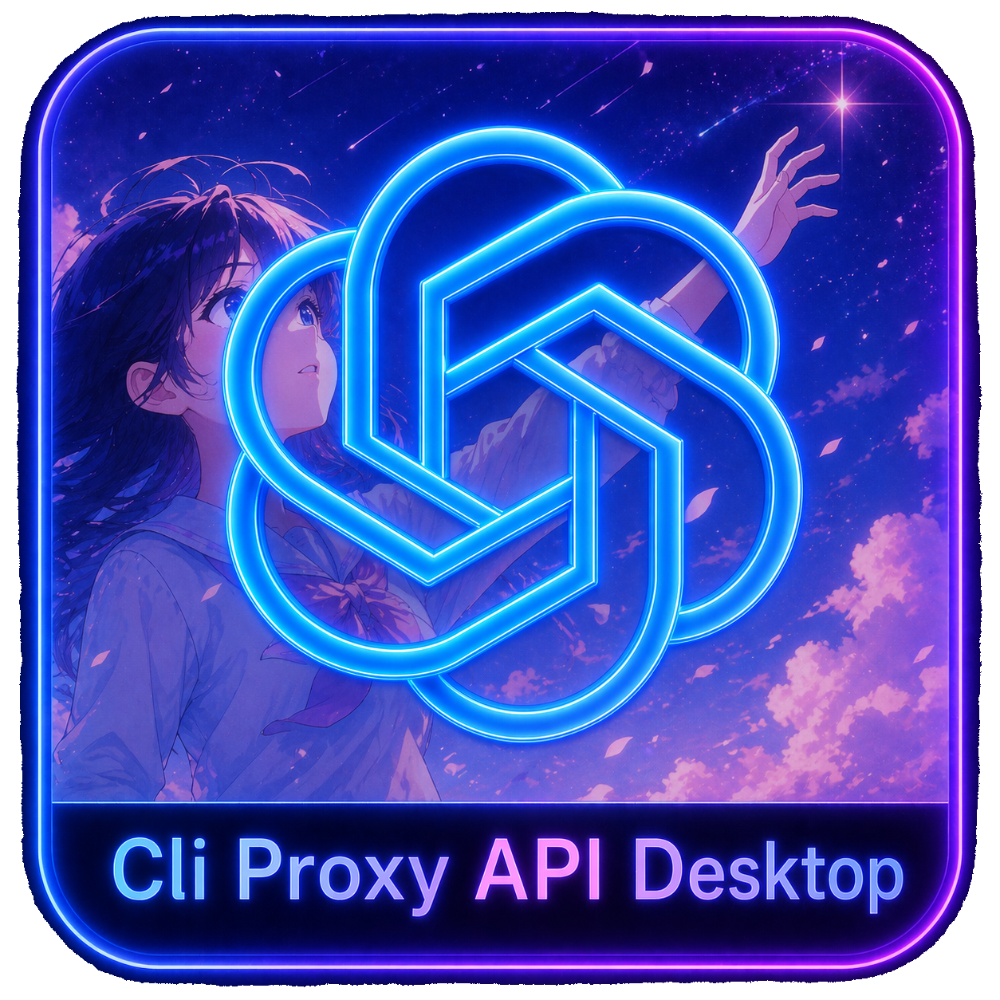

# Cli Proxy API Desktop

  

## 简介

Cli Proxy API Desktop 是一个面向 `Windows + 中文` 的统一控制平面，目标是把 CPA Runtime、Codex 模式切换、官方运行时接管、更新中心、插件市场和持久化状态收敛成一个可安装、可更新、可卸载、可持续演进的桌面产品。

`Cli Proxy API Desktop` 现在已经不是“建库中的新想法”，而是一个已经推进到 `M5 官方覆盖整合`、并完成双官方基线同步能力与覆盖差异矩阵的主仓。当前主仓只保留 CPAD 自己的 Electron + Go 结构；`CPA-UV`、官方主程序基线、官方管理中心基线和插件源仓都作为受控外部资产存在，不再反向污染主仓目录。

点击链接加入群聊【CPAD(CLI Proxy API Desktop)交流群】：https://qm.qq.com/q/OgLgNmwk2O

相关文档：

- [完整开发计划](docs/开发计划.md)
- [CPA-UV 覆盖官方基线差异矩阵](docs/CPA-UV覆盖官方基线差异矩阵.md)
- [已确认条目](docs/已确认事项.md)
- [待整合资产清单](docs/待整合资产清单.md)
- [开源继承声明](docs/开源继承声明.md)
- [Codex 仓库协作约束](AGENTS.md)

## 当前状态

当前仓库执行状态：

- 当前里程碑：`M5 官方覆盖整合`
- 已完成里程碑：`M0`、`M1`、`M2`、`M3`、`M4`、`M4.5`
- 当前收尾阶段：`4.5 官方覆盖整合` 的差异矩阵已完成，正在进入兼容层收口
- 当前主分支：`origin/main`

截至 `2026-04-22` 最近一次同步，当前已确认的基线如下：

- 官方主程序基线：`router-for-me/CLIProxyAPI` -> `a188159632429b3400d5dadd2b0322afba60de3c`
- 官方管理中心基线：`router-for-me/Cli-Proxy-API-Management-Center` -> `b45639aa0169de8441bc964fb765f2405c10ccf4`
- 本地 CPA-UV 源仓：`C:\Users\Reol\workspace\CPA-UV-publish` -> `788076c630035c307b6cdf675554dd7b54cc6cee`
- 本地插件源仓：`C:\Users\Reol\workspace\omni-bot-plugins-oss` -> `d5be4b069448f9ebfb01c18b037022f015e9eb54`

官方双基线本地受控工作树已建立到：

- `C:\Users\Reol\Cli Proxy API Desktop\upstream\CLIProxyAPI`
- `C:\Users\Reol\Cli Proxy API Desktop\upstream\Cli-Proxy-API-Management-Center`

## 已落地能力

当前已完成并可验证的能力包括：

- Electron 桌面主进程、预加载桥、前端首页和操作入口
- Windows Service 宿主、状态落盘、服务事件持久化与日志预览
- 安装目录布局、`service-state.json`、`app.db`、运行时日志与插件状态文件
- `codex-mode.json` 与 `codex.exe` shim 的受控模式切换
- CPA Runtime 的受控 `status / build / start / stop`
- 受控 `config.yaml` 托管与旧默认端口自动迁移
- CPAD 默认托管端口已收敛到 `127.0.0.1:2723`
- 插件市场的刷新、安装、更新、启用、禁用和诊断
- 更新中心对官方双基线、CPA-UV 源仓、插件源仓、受控运行时的状态检查
- 官方双基线同步命令与桌面端触发入口
- CPAD 主仓结构清理，旧仓只保留为来源与基线

## 当前缺口

当前还没有完成的主线工作：

- 按差异矩阵把 `CPA-UV -> 官方主程序` 的关键覆盖项抽成稳定兼容层
- 把官方管理中心能力按 CPAD 产品边界重新接入，而不是简单搬运原仓结构
- 把官方 Codex CLI 私有运行时的下载、安装、升级和版本放行真正落地
- 把 Windows Service 的正式安装/卸载流程与安装器交付链路打通
- 为首版发布补足端到端验证、卸载清理、ACL、服务账户权限和发布文档

## 相对官方项目的产品化差异

- 只支持 `Windows + 中文`，不为其他平台和多语言分散工程精力
- 统一使用安装目录 `C:\Users\<主用户>\Cli Proxy API Desktop\`
- 通过系统服务承担后台常驻职责，桌面端只负责交互与管理
- 通过产品内部状态文件、数据库和日志替代零散脚本拼装
- 通过桌面端统一管理 CPA Runtime、Codex 模式、插件市场和更新中心
- 统一采用点对点同步，不引入新的中心化多端同步层
- 保持 CPAD 主仓干净，把官方基线、CPA-UV 和插件源都放在受控外部资产层

## 开源继承与许可证

本项目不是否认 `CLIProxyAPI / CPA-UV` 的来源关系，而是在其能力基础上进行 Windows 中文桌面产品化重组。只要本仓或后续发布产物中继续包含来自 `CLIProxyAPI`、`Cli-Proxy-API-Management-Center`、`CPA-UV` 或其重要衍生部分的代码与资源，就必须继续保留对应的开源许可链路与版权说明。

详细说明见：

- [LICENSE](LICENSE)
- [开源继承声明](docs/开源继承声明.md)

## 依赖

当前开发与运行基线限定为：

- Windows 10/11 x64
- Git
- Node.js LTS
- Electron
- SQLite
- Go
- 官方 Codex CLI Windows 版本

说明：

- 不支持 WSL 作为默认运行前置
- 不纳入与 CPAD 主链路无关的第三方依赖集合
- Codex CLI 的版本选择与更新放行由桌面端统一管理

## 开发使用

当前阶段建议按以下方式使用：

1. 克隆本仓库。
2. 阅读 [完整开发计划](docs/开发计划.md)、[CPA-UV 覆盖官方基线差异矩阵](docs/CPA-UV覆盖官方基线差异矩阵.md)、[已确认条目](docs/已确认事项.md)、[待整合资产清单](docs/待整合资产清单.md) 与 [开源继承声明](docs/开源继承声明.md)。
3. 安装 Node.js 依赖：`npm install`
4. 构建桌面壳：`npm run build`
5. 构建服务宿主：`npm run build:service`
6. 构建 `codex.exe` shim：`npm run build:shim`
7. 查看当前安装目录布局：`npm run service:layout`
8. 查看当前宿主快照：`npm run service:status`
9. 查看当前 Codex 模式：`npm run codex:mode:status`
10. 查看 CPA Runtime 状态：`npm run cpa:runtime:status`
11. 受控构建 CPA Runtime：`npm run cpa:runtime:build`
12. 受控启动 CPA Runtime：`npm run cpa:runtime:start`
13. 受控停止 CPA Runtime：`npm run cpa:runtime:stop`
14. 刷新插件市场清单：`npm run plugin:market:refresh`
15. 查看插件市场状态：`npm run plugin:market:status`
16. 刷新更新中心状态：`npm run update:center:check`
17. 查看更新中心状态：`npm run update:center:status`
18. 同步官方双基线工作树：`npm run update:center:sync`
19. 启动桌面开发环境：`npm run dev`

## Windows 开发与分发说明

- 先执行 `npm install` 安装依赖。
- 执行 `npm start` 可以在本地构建生产 bundle 并直接拉起 Electron 窗口，用于验证“桌面壳是否能真正起窗”。
- 执行 `npm run dist:win` 会按顺序构建 `cpad-service.exe`、`codex.exe`、Electron bundle，并通过 `electron-builder` 产出 Windows 分发物。
- 当前 `dist:win` 的默认产物位于 `release/`：
  - `release/win-unpacked/`
  - `release/Cli Proxy API Desktop-Setup-<version>-x64.exe`
  - `release/Cli Proxy API Desktop-Portable-<version>-x64.exe`
- 打包配置位于 `electron-builder.yml`，打包脚本位于 `scripts/package-windows.ps1`。
- 当前产物已经能作为“首个可见安装包 / 便携包”使用，但仍属于首版交付链路，不代表安装体验已经完全收口。
- 当前已知未完成项仍包括：正式的 Windows Service 首次安装/卸载引导、安装目录 ACL、服务账户权限、卸载清理、代码签名与产品图标定制。

## 近期路线

下一阶段优先级按当前主线排序如下：

1. 按 [CPA-UV 覆盖官方基线差异矩阵](docs/CPA-UV覆盖官方基线差异矩阵.md) 抽离品牌/版本适配层、`Codex App Server` 代理与可比额度调度模块。
2. 把管理更新流改写进 CPAD 更新中心，并切断旧 `management.html` 继承路径。
3. 落地受控 Codex CLI 私有运行时的下载、校验、安装和更新放行。
4. 完成 Windows Service 安装/卸载、安装目录 ACL、安装器与卸载器链路。
5. 建立首版发布前的端到端验证矩阵、日志诊断与回滚策略。

## Star History

